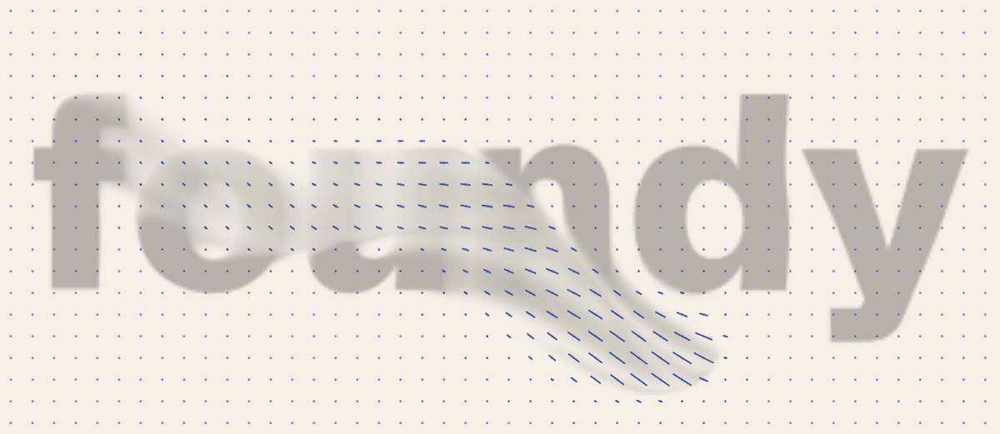
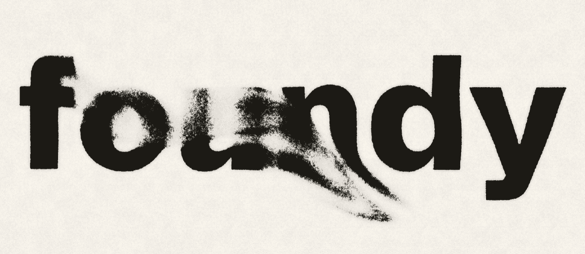
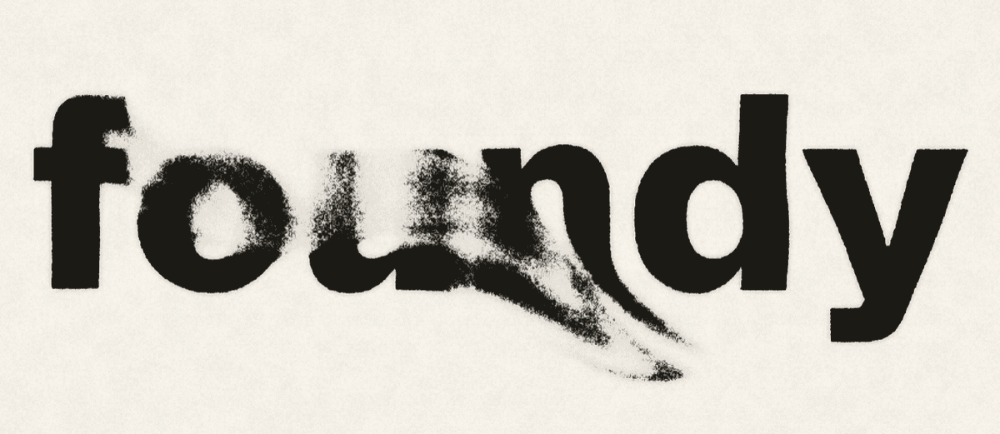
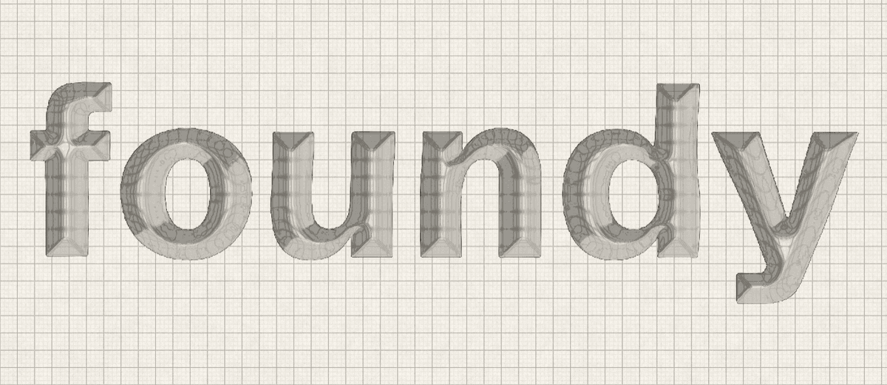
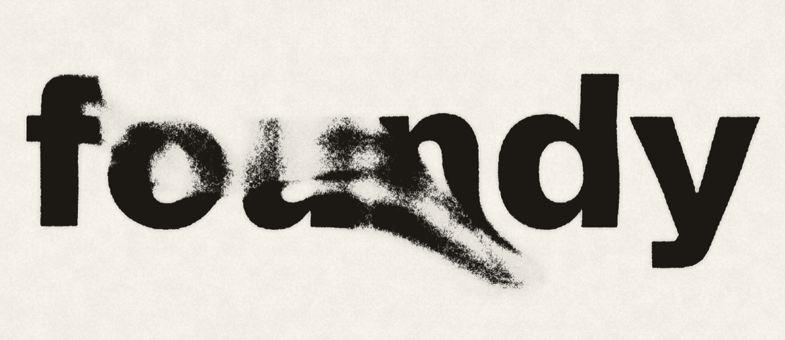
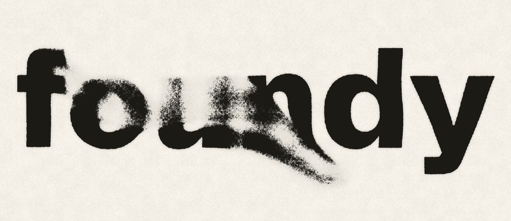

# Phase 2 히어로 셰이더 스파이크 결과

> 2026-10-07 · 브랜치 `redesign/phase-2-spike` (phase-1 위에 스택). 통과 기준: **스택 확정 + 성능 예산 수치 확보.**
> 이 문서는 증거와 권고다. 홈 히어로에는 아직 통합하지 않았다(홈은 여전히 클라이언트 JS 0).

## 0. 결론 먼저

| 질문 | 권고 |
|---|---|
| 렌더링 스택 | **raw WebGL2 + 소형 GLSL(핑퐁 FBO)**. three(WebGPURenderer+TSL)는 같은 화면을 내지만 JS가 **약 30배**(gzip 239 KB vs 8 KB), 초기화가 **1.8~66배** 느리다(Chrome 30 vs 17 ms, Safari 기준 465 vs 7 ms). 이 하드웨어에서는 프레임 시간 차이가 측정되지 않았다(둘 다 vsync에 걸림). |
| 비주얼 방향 | **riso(2색 오버프린트)를 1순위, ink(잉크 번짐)를 2순위**로 추천. refract(유리 굴절)는 가장 "해부 가능"하지만 아직 거칠고 정지 상태 가독성이 약해 비추. 최종 선택은 사용자 몫(9절). |
| 성능 예산(제안) | 아래 7절 표. 실기기(iPhone) 수치가 들어오기 전까지는 "이 Mac에서의 상한선"으로만 읽을 것. |

한계를 먼저 밝힌다. **모든 측정은 M5 Pro Mac 한 대(Playwright 구동 Chrome 155 / WebKit 26 / Firefox 155)에서 했고, 어느 케이스도 60 Hz vsync를 넘기지 못해 프레임 시간만으로는 스택을 가를 수 없었다.** 구분이 되는 것은 번들 크기, 초기화/컴파일 시간, GPU 연속 비용(bench)이다. 모바일 GPU 수치는 없다(`device-checklist.md` 참고).

## 1. 방법

### 파이프라인(두 스택 모두 동일)

```
SDF(워드마크) -> domain warp -> flow field(속도장 + 잉크 이류) -> composite
```

| 단계 | 구현 |
|---|---|
| 1 SDF | 로드시 1회: 사이트 폰트(Schibsted Grotesk, 820)를 캔버스 2D로 그린 뒤 **안티앨리어싱 반영 Felzenszwalb EDT**(TinySDF 방식)를 CPU에서 계산, 1024xN `R16F` 텍스처로 업로드. |
| 2 warp | SDF 조회 좌표를 2옥타브 value noise로 어긋나게 해서 가장자리 번짐/울렁임. |
| 3 flow | 속도장 96칸(긴 변), 잉크 밀도장 384칸(긴 변), `RGBA16F` 핑퐁. 포인터(선분 가우시안)가 속도장을 끌고, 밀도는 semi-Lagrangian 이류 후 `1-exp(-dt*1.4)` 비율로 **rest 상태(워드마크)로 복귀**. 압력 투영 없음(비압축성 불필요). |
| 4 composite | 밀도 -> 종이/잉크(색은 런타임에 `tokens.css` 커스텀 프로퍼티에서 읽음), 종이 결(grain/fiber), look별 합성. |

공통 요구사항 구현: 시간 기반(`dt` 클램프 1/20 s, 프레임 카운트 미사용), DPR 상한 1.5(`?dpr=`로 변경), IntersectionObserver와 `visibilitychange`로 정지, `prefers-reduced-motion`이면 정지 프레임 1장만 렌더(리사이즈 시에도 재그림), ResizeObserver, `dispose()`(리스너/관찰자/GL 리소스/컨텍스트 해제).

### 왜 SDF를 런타임 CPU EDT로 만들었나

| 후보 | 비용 | 판단 |
|---|---|---|
| 빌드타임 베이크(node + fontkit/sharp) | 런타임 0 ms, 에셋 ~20-60 KB 추가 | 가장 싸지만 폰트/워드마크 변경마다 에셋 파이프라인 필요. 워드마크 디자인이 아직 미결(계획 9절)이라 보류 |
| GPU JFA | 패스 10여 개, 정밀도 이슈 | 이 크기(1024x306)에서는 과함 |
| **런타임 EDT(채택)** | 메인스레드 **15~39 ms 1회**(측정 4절) | 폰트만 있으면 되고 두 스택이 코드를 공유. 단점: 첫 프레임 전 한 번 메인스레드를 막음 |

권고: 워드마크가 확정되면 **빌드타임 베이크로 이동**(그러면 첫 프레임 비용에서 15~39 ms가 빠진다). iPhone에서 베이크가 50 ms를 넘으면 즉시 이동.

### 하네스

- `/spike/raw`, `/spike/three` (Astro 페이지, `noindex, nofollow`, 사이트맵 제외, 내비 링크 없음).
- 쿼리: `?stage=sdf|warp|flow|composite`, `?look=ink|refract|riso`(three는 ink만), `?hud=1`, `?dpr=`, `?gl=webgl2`(three에서 `forceWebGL`), `?bench=1`, `?t=<초>`(애니메이션 시계 고정, 스크린샷용).
- HUD: 백엔드, 프레임 시간 중앙값/p95/최대(rAF 간격, 최근 600프레임), JS 프레임당 시간, 긴 프레임 수, SDF 베이크/초기화/첫 프레임, JS 전송량.
- `scripts/spike/`: `measure.mjs`(측정 매트릭스), `lifecycle.mjs`(생명주기 검증), `screens.mjs`(스크린샷), `sizes.mjs`(gzip/brotli), `tables.mjs`(이 문서의 표 생성).
- 원자료: `docs/spike/results.json`, `docs/spike/results-stress.json`.

측정 정의:

- **init**: 렌더러 생성부터 모든 파이프라인 컴파일/준비 완료까지. three는 `renderer.init()` + `compileAsync`, raw는 프로그램 링크 + `LINK_STATUS` 확인(드라이버 지연 컴파일을 강제).
- **first frame after init**: init 시작부터 첫 프레임이 GPU에서 끝날 때까지(`readPixels` 동기화).
- **first frame from nav start**: `performance.now()` 기준(JS 다운로드/파싱 + SDF 베이크 포함, localhost라 네트워크 시간 거의 없음).
- **드래그**: 5초간 캔버스 위에서 리사주 궤적으로 포인터를 움직임(약 300 move 이벤트). rAF 간격 통계. "긴 프레임"은 **>20 ms**(60 Hz에서 vsync 1회 이상 놓침)와 >33 ms. WebKit은 타이머가 1 ms로 반올림되어 16.7 ms 기준을 그대로 쓰면 오탐이 나므로 20 ms를 썼다.
- **bench**: 프레임을 연속으로 그리고 매번 1픽셀 `readPixels`(WebGPU는 `queue.onSubmittedWorkDone`)로 GPU 완료를 기다림. vsync에 묶이지 않은 "GPU 포함 프레임 비용". WebKit/Firefox는 `performance.now` 해상도가 1 ms라 "0"은 "1 ms 미만"의 뜻.
- 뷰포트: 데스크톱 1440x900 @DPR 2(상한 1.5 적용 -> 캔버스 2040x884), 모바일 390x844 @DPR 3 에뮬레이션(캔버스 532x573; 마우스 이벤트로 드래그, 실제 터치는 아님).

## 2. 번들 크기 (`astro build` 산출물, `scripts/spike/sizes.mjs`)

| 페이지 | JS raw | gzip -9 | brotli -11 | 비고 |
|---|---:|---:|---:|---|
| 홈 `/` | 0 | **0** | 0 | 스크립트 태그 0개(확인됨) |
| `/spike/raw` | 19.6 KB | **8.1 KB** | 7.3 KB | 공통(SDF/루프/HUD ~3.4 KB gz) 포함. 순수 raw GL 코드는 약 4.7 KB gz |
| `/spike/three` | 878.5 KB | **239.2 KB** | 191.4 KB | `three/webgpu` + `three/tsl`, WebGPU와 WebGL2 백엔드가 한 청크에 모두 포함 |

`three/webgpu` 배럴에서 쓰는 클래스만 import해도 롤업이 거의 줄이지 못한다(노드 클래스들이 모듈 평가 시점에 `addMethodChaining` 등 부작용을 실행). 폴백을 유지하는 한 약 240 KB gz가 사실상 하한으로 보인다. 목업 케이스 스터디의 예산(GL 청크 90 KB gz)을 **three는 2.7배 초과, raw는 11배 여유**.

## 3. 측정 결과

### 3.1 시작 비용(데스크톱, 캔버스 2040x884)

| browser | page | backend | SDF bake ms | init ms | first frame after init ms | first frame from nav start ms |
|---|---|---|---:|---:|---:|---:|
| chrome 155 | raw | WebGL2 | 22.6 | 17.3 | 20.6 | 82 |
| chrome 155 | three | WebGPU | 22.1 | 30.4 | 42.9 | 151 |
| chrome 155 | three-gl2 | WebGL2 | 21.3 | 46.7 | 67.1 | 129 |
| webkit 26 | raw | WebGL2 | 39 | 7 | 12 | 101 |
| webkit 26 | three | WebGPU | 15 | **465** | **488** | **870** |
| webkit 26 | three-gl2 | WebGL2 | 16 | 515 | 548 | 877 |
| firefox 155 | raw | WebGL2 | 20 | 19 | 26 | 145 |
| firefox 155 | three | WebGL2 (자동 폴백) | 18 | 41 | 68 | 170 |
| firefox 155 | three-gl2 | WebGL2 | 21 | 41 | 68 | 167 |

모바일 뷰포트(캔버스 532x573)도 같은 경향이다: WebKit raw 5 ms vs three 461 ms(WebGPU)/531 ms(WebGL2), Chrome raw 6 ms vs three 28/47 ms, Firefox raw 13 ms vs three 40 ms. 전체 표는 `results.json`.

### 3.2 5초 포인터 드래그, 프레임 간격(데스크톱)

| browser | page | backend | frames | median ms | p95 ms | max ms | >20 ms | >33 ms | JS/frame ms |
|---|---|---|---:|---:|---:|---:|---:|---:|---:|
| chrome 155 | raw | WebGL2 | 300 | 16.7 | 16.7 | 16.8 | 0 | 0 | 0 |
| chrome 155 | three | WebGPU | 301 | 16.7 | 16.7 | 16.8 | 0 | 0 | 0.4 |
| chrome 155 | three-gl2 | WebGL2 | 301 | 16.7 | 16.7 | 16.8 | 0 | 0 | 0.3 |
| webkit 26 | raw | WebGL2 | 300 | 17 | 18 | 20 | 0 | 0 | 0 |
| webkit 26 | three | WebGPU | 301 | 17 | 19 | 20 | 0 | 0 | 0 |
| webkit 26 | three-gl2 | WebGL2 | 300 | 17 | 18 | 19 | 0 | 0 | 1 |
| firefox 155 | raw | WebGL2 | 301 | 16.66 | 16.68 | 17.36 | 0 | 0 | 0 |
| firefox 155 | three | WebGL2 | 301 | 16.66 | 16.68 | 17.4 | 0 | 0 | 0 |
| firefox 155 | three-gl2 | WebGL2 | 301 | 16.66 | 16.7 | 17.42 | 0 | 0 | 0 |

모바일 뷰포트에서도 전부 median 16.7 / 긴 프레임 0(단 WebKit three-gl2 모바일에서 23 ms 1회). **모두 60 Hz vsync 상한에 걸려 있어 스택 간 차이가 안 보인다.** three 쪽 JS/frame이 raw보다 약 0.3 ms 높은 것(노드 그래프 업데이트/렌더 리스트 처리)이 유일한 CPU 차이.

### 3.3 GPU 포함 연속 비용(bench), 데스크톱

| browser | page | backend | median ms | p95 ms | max ms |
|---|---|---|---:|---:|---:|
| chrome 155 | raw | WebGL2 | 0.4 | 0.5 | 2.1 |
| chrome 155 | three | WebGPU | 0.4 | 0.8 | 3.4 |
| chrome 155 | three-gl2 | WebGL2 | 0.4 | 0.5 | 2.6 |
| webkit 26 / firefox 155 | 전부 | | <1 | 1 | 2~3 |

(0.3~0.4 ms는 대부분 `readPixels` 동기화 바닥값이다.) 해상도를 키운 스트레스(Chrome, DPR 3 강제, 4080x1768 = 7.2 Mpx):

| page | backend | bench median ms | p95 ms | max ms |
|---|---|---:|---:|---:|
| raw | WebGL2 | 0.9 | 1.0 | 4.7 |
| three | WebGPU | 1.1 | 2.2 | 5.3 |
| three-gl2 | WebGL2 | 0.9 | 1.1 | 5.4 |

픽셀 수에 대한 비용은 대략 `0.3 ms(고정, 시뮬레이션+동기화) + ~0.1 ms/Mpx`. three/WebGPU는 p95가 raw의 약 2배(꼬리가 길다). 모바일 GPU가 이 Mac보다 10~30배 느리다고 가정하면 모바일 캔버스(0.3 Mpx)는 3~10 ms 수준 -> **실기기 확인 필요**(예산 8 ms 이내가 목표).

### 3.4 look별 비용(raw WebGL2, 데스크톱)

세 look 모두 bench 중앙값 0.4 ms(Chrome), 드래그 p95 vsync 상한. 비용 차이는 이 환경에서 측정되지 않음. 코드 길이: ink 약 8줄, refract 약 35줄, riso 약 20줄(composite 분기).

### 3.5 사용된 GPU 경로

| browser | `navigator.gpu` | raw | three 기본 | three `?gl=webgl2` | GPU |
|---|---|---|---|---|---|
| Chrome 155 | 있음 | WebGL2 | **WebGPU** | WebGL2 | ANGLE Metal, Apple M5 Pro(WebGL 문자열; WebGPU 어댑터 정보는 three 백엔드에서 노출되지 않아 n/a) |
| WebKit 26 (Playwright) | 있음 | WebGL2 | **WebGPU** | WebGL2 | "Apple GPU" |
| Firefox 155 | 있음(!) | WebGL2 | **WebGL2로 자동 폴백** | WebGL2 | "Apple M1, or similar"(마스킹됨) |

Firefox는 `navigator.gpu`가 존재해도 three가 어댑터를 얻지 못해 WebGL2로 떨어졌다(계획의 "Firefox = WebGL2 폴백 경로"와 일치). 모두 헤드리스(Playwright) 실행이고 이 Mac의 GPU를 그대로 썼으므로 SwiftShader 같은 소프트웨어 렌더러 수치는 아니다. 단 **Playwright WebKit은 실제 iOS Safari가 아니다.**

## 4. 코드 복잡도 / DX

| | raw WebGL2 | three TSL |
|---|---|---|
| 파일 | `raw.ts` 447줄 | `three.ts` 387줄 |
| 셰이더 | GLSL 197줄(3 look 전부 포함; ink만이면 약 142줄) | TSL 155줄(ink만) |
| 호스트/배관 | 약 243줄(FBO/텍스처/유니폼 위치/프로그램 링크/뷰포트/바인딩) | 약 230줄(import 약 45줄, 유니폼 선언, RT 풀, 패스 스왑) |
| 공통(양쪽 공유) | `common.ts` 557줄(SDF 베이크, 루프/생명주기, HUD, bench) | |

- **비슷한 길이.** 배관은 three가 덜 쓰지만(렌더 타깃/컴파일/백엔드 선택이 라이브러리 몫) import 목록과 TSL 노드 체이닝(`a.mul(b).add(c)`)이 GLSL 수식보다 읽기 어렵다.
- **TSL 타입 마찰**: `Fn(([p]) => ...)` 구조분해와 `vec2(...)` 오버로드가 TypeScript에서 `VarNode`/`Node`를 구분해 타입 에러를 20개 냈고, 결국 노드를 `any`로 느슨하게 받아 통과시켰다. 디버깅은 GLSL 컴파일 로그가 더 직접적이다.
- **TSL의 장점**: 단계가 이미 노드 단위라 Inspect(4단계)에 개념적으로 잘 맞는다. 하지만 이 스파이크에서 단계 분리는 raw에서도 "프로그램 하나 = 단계 하나"로 똑같이 되었고, 단계 선택은 `#define STAGE`로 컴파일 시점에 처리해 불필요한 단계는 컴파일 자체가 안 된다.
- **raw의 단점**: 유니폼/텍스처 유닛 수동 관리, 컨텍스트 로스트 복구는 직접 구현 필요(스파이크 미구현), 반정밀도 FBO 확장(`EXT_color_buffer_float` 등) 가용성 직접 확인 필요.

## 5. WebGPU vs WebGL2 동등성에서 발견한 것

1. **시각 동등성은 양호.** 같은 `?t=2` 정지 장면의 픽셀 차이: raw vs three-WebGPU 평균 절대 오차 1.66/255, raw vs three-WebGL2 1.43, three WebGPU vs WebGL2 0.95(팔레트 PNG 양자화 포함; 40 이상 차이 나는 픽셀 0.04%). 드래그 중 잉크 모양도 눈으로 구분되지 않는다(`parity-*-swipe.png`). 계획의 "WebGL2를 기준으로 삼는다"는 방침은 이 파이프라인에서는 큰 비용 없이 지킬 수 있다.
2. **출력 색공간**: three는 기본으로 sRGB 변환을 걸어 팔레트 값이 달라진다. `renderer.outputColorSpace = LinearSRGBColorSpace`로 꺼야 raw와 같은 색이 나온다(기본값에 의존하면 양쪽 백엔드가 같게 틀어지므로 눈치채기 어려움).
3. **렌더 타깃 UV 방향**: QuadMesh의 `uv()`는 y가 아래로 증가한다. RT를 같은 `uv()`로 읽고 쓰면 일관되고 WebGPU/WebGL2에서 동일하게 동작했지만, 논리 좌표(y-up)로 바꾸는 코드를 별도로 넣어야 했다.
4. **초기화 비용이 백엔드와 무관하게 큼**: Safari(WebKit)에서 three는 WebGPU 465 ms, WebGL2 515 ms. raw WebGL2는 7 ms. 즉 비용의 원인은 WebGPU 자체가 아니라 three의 노드 빌더(셰이더 문자열 생성) + 파이프라인 컴파일.
5. **Firefox 자동 폴백**은 동작했지만 `navigator.gpu`만으로는 경로를 알 수 없다 -> HUD의 `backend=`를 기준으로 삼을 것.
6. **GPU 어댑터 정보**: three 백엔드는 어댑터 info를 노출하지 않아 WebGPU 경로의 GPU 이름을 얻지 못했다(`navigator.gpu.requestAdapter()`를 별도로 호출해야 함).
7. **three p95 꼬리**: bench에서 three/WebGPU의 p95가 raw의 약 2배(7.2 Mpx에서 2.2 vs 1.0 ms). 의미 있는 차이인지는 모바일에서 재확인 필요.
8. **API 소음**: `QuadMesh.renderAsync`는 deprecated, 컴파일은 `compileAsync`를 직접 호출해야 첫 프레임 hitch를 숨길 수 있다. 버전(r186)에 묶인 API라 업그레이드 부담이 있다.
9. 두 백엔드 모두 `dispose()` 후 콘솔 에러 없음, 생명주기 검증 통과(6절).

## 6. 생명주기 검증 (`scripts/spike/lifecycle.mjs`, Chrome, 3개 경로 모두 동일 결과)

| 항목 | 결과 |
|---|---|
| `prefers-reduced-motion: reduce` | 루프 미동작(frames 0), 정지 프레임 1장 렌더됨, 리사이즈 후에도 재그림 |
| 화면 밖(IntersectionObserver) | 밖에서 정지, 다시 보이면 재개 |
| 탭 숨김(`visibilitychange`) | 정지, 복귀 시 재개(`dt`는 1/20 s로 클램프) |
| 리사이즈 | 캔버스/시뮬레이션 텍스처 재할당, rest 상태로 스냅 |
| dispose | 리스너/관찰자 해제, 이후 에러 없음 |

## 7. 성능 예산 제안 (raw WebGL2 기준, 이 Mac 실측 + 실기기 미확인)

| 항목 | 목표(제안) | 이 Mac에서 측정 | 비고 |
|---|---|---|---|
| 홈 첫 로드 클라이언트 JS | 0 KB (GL 청크는 지연 로드) | 0 KB | 유지 |
| GL 청크 gzip | **<= 15 KB** | 8.1 KB(스파이크, HUD/bench 포함) | three는 239 KB |
| init(컴파일 포함) | <= 50 ms | 5~19 ms (3개 브라우저) | three 30~515 ms |
| SDF 베이크(메인스레드) | <= 25 ms, 초과 시 빌드타임 베이크로 이동 | 15~39 ms | 가장 큰 단일 항목 |
| 첫 프레임(청크 로드 후) | <= 120 ms | 8~26 ms | 목업 예산과 일치 |
| 프레임 비용(GPU 포함, 폰 크기 캔버스 0.3 Mpx) | <= 8 ms | **0.3 ms**(M5 Pro) | 실기기 필수 |
| JS/frame | <= 0.5 ms | raw ~0, three 0.3~0.4 | |
| DPR 상한 | 1.5(품질 등급으로 내림) | 7.2 Mpx에서도 0.9 ms | 상한은 폰 GPU 때문에 유지 |
| 시뮬레이션 해상도 | 속도 96 / 밀도 384(긴 변), 프레임 시간 기반으로 하향 | | |

목업 케이스 스터디(`hero-shader.md`)의 "측정(mock)" 수치는 이 표로 교체해야 한다(Phase 3 이후, 실기기 값과 함께).

## 8. 비주얼 방향 스케치

모든 look은 라이트 종이/잉크 팔레트(+ 포인트 컬러 vermilion `--accent`)만 사용하고, 정지 상태에서 "foundy"가 읽힌다. 데이터는 전부 같은 밀도장이다.

### 단계별(raw)

| 1 SDF | 2 warp |
|---|---|
|  |  |

| 3 flow (스와이프 직후, 화살표 = 속도장) | 4 composite (ink, 스와이프 직후) |
|---|---|
|  |  |

### look 3종 (왼쪽 정지, 오른쪽 스와이프 직후)

**ink: 종이 위 잉크 번짐 (계획의 기본안).** 가장자리 번짐 + 종이 결로 임계값을 깎은 잉크 + 약한 헤일로. 가장 "정직"하고 기존 포스터 SVG와 가장 닮았다.

| 정지 | 스와이프 |
|---|---|
|  |  |

**refract: 유리 굴절.** 워드마크가 유리 슬랩이 되어 모눈 종이를 휘게 한다. 스와이프하면 유리가 끌려간다. 해부하기(굴절=기울기) 좋지만 SDF 중심축 접힘과 8비트급 기울기 노이즈로 둔탁한 면이 남아 있고(스와이프 사진의 베벨 링), 정지 상태 대비가 낮다. 더 가려면 별도 높이장이 필요.

| 정지 | 스와이프 |
|---|---|
|  |  |

**riso: 2색 오버프린트(진한 잉크 + vermilion 하프톤 후광).** 리소/실크스크린 인쇄에서 쓰는 어긋난 2도 인쇄. 방문자가 문지르면 두 색판이 속도장에 따라 어긋난다. 정지 상태는 선명한 검정 워드마크에 붉은 점의 헤일로. 파티클/네온 클리셰를 피하고, "종이에 찍힌 물건"이라는 사이트 전체 재질 방향과 일치하며, 하프톤 때문에 Inspect(단계 해부)에서 "색판 분리"를 보여주기 좋다.

| 정지 | 스와이프 |
|---|---|
|  |  |

모바일(390x844, DPR 2 스크린샷):  

### 스택 동등성(정지/스와이프, 위부터 raw, three WebGPU, three WebGL2)

| 정지 | 스와이프 |
|---|---|
|  |  |
|  |  |
|  |  |

## 9. 권고와 근거

**스택: raw WebGL2.**

1. **크기**: 8 KB vs 239 KB gz. 계획의 핵심 원칙("GL은 첫 페인트를 막지 않음", 정적 포스터 -> 크로스페이드)에서도 청크가 작을수록 크로스페이드가 빨라진다. three는 예산(90 KB)을 넘는다.
2. **초기화**: Safari에서 465 ms vs 7 ms. 포스터 위에 올라오는 시점이 0.5초 늦어진다.
3. **동등성 리스크**: 백엔드가 하나(WebGL2)라서 "WebGPU 경로"와 "폴백 경로"를 따로 검증할 필요가 없다. 계획의 테스트 매트릭스(Safari/iPhone WebGPU 경로, Firefox WebGL2 경로)가 단일 경로로 줄어든다.
4. **필요 없는 능력**: compute/대규모 파티클이 없다. 96x40 속도장 + 384x160 밀도장은 프래그먼트 패스로 충분하고, 7.2 Mpx에서도 1 ms 안쪽.
5. **Inspect 적합성**: 단계가 별도 프로그램이라 정지 이미지/스크럽이 TSL과 동일하게 가능. TSL의 "노드 그래프 자체를 보여주는" 이점은 Inspect 해설이 문장+이미지인 이상 필수가 아님.

**트레이드오프(받아들이는 것)**: GLSL 수동 배관, 컨텍스트 로스트 복구 직접 구현, `EXT_color_buffer_float` 없으면 정적 포스터로 폴백, WebGPU 미래성 포기(필요 시 TSL 구현은 이 브랜치의 `src/spike/three.ts`에 남아 있음).

**three를 택해야 하는 경우**: 사이트의 다른 곳에서 3D 장면/후처리 체인이 곧 필요해져 three를 어차피 싣게 될 때. 그때는 비용이 이미 지불된 것이므로 TSL 구현을 재사용할 수 있다.

## 10. 열린 질문 (사용자 결정)

1. **어느 look?** 추천은 riso(1순위) / ink(2순위). refract는 더 다듬을 가치가 있는지? (계획 9절 "시각 방향" 미결 항목)
2. **스택**: raw WebGL2로 확정해도 되는지(three는 참고 구현으로만 보존).
3. **워드마크**: 서체 기반 SDF(현재 Schibsted Grotesk 820)로 간다면 SDF를 **빌드타임 베이크**로 옮길지(런타임 15~39 ms 제거), 직접 제작이면 베이크가 필수.
4. **실기기**: `docs/spike/device-checklist.md`의 항목 1~2번(iPhone Safari에서 raw / three / three `gl=webgl2`, look 3종)과 HUD 스크린샷이 필요하다. 이 결과가 오면 7절 예산의 "프레임 비용" 행을 확정한다.
5. 캔버스 위 터치: 스파이크는 `touch-action: none`이라 캔버스 위 세로 스크롤이 막힌다. 정식 구현에서 히어로 위 스크롤을 허용할지(허용하면 포인터 힘을 가로 제스처로 제한).

## 11. 측정하지 못한 것

- iPhone Safari/모바일 GPU(실제 터치, 발열, 3분 연속 사용). 체크리스트로 위임.
- Playwright WebKit은 Safari 자체가 아님(WebGPU 포함 동작은 유사하나 동일하지 않을 수 있음).
- Chrome 외 WebGPU 어댑터 이름, 전력/발열, 배터리.
- 컨텍스트 로스트/복구.
- 이 Mac의 GPU가 너무 빨라 모든 케이스가 vsync에 걸림. 스택 간 프레임 시간 차이는 모바일에서만 의미가 생길 가능성이 큼.
